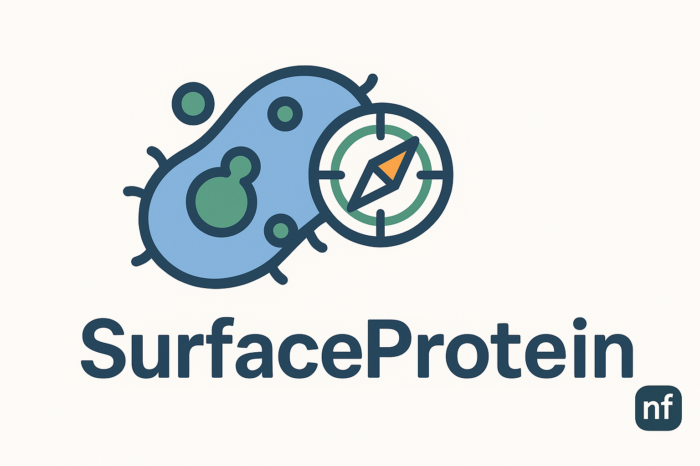
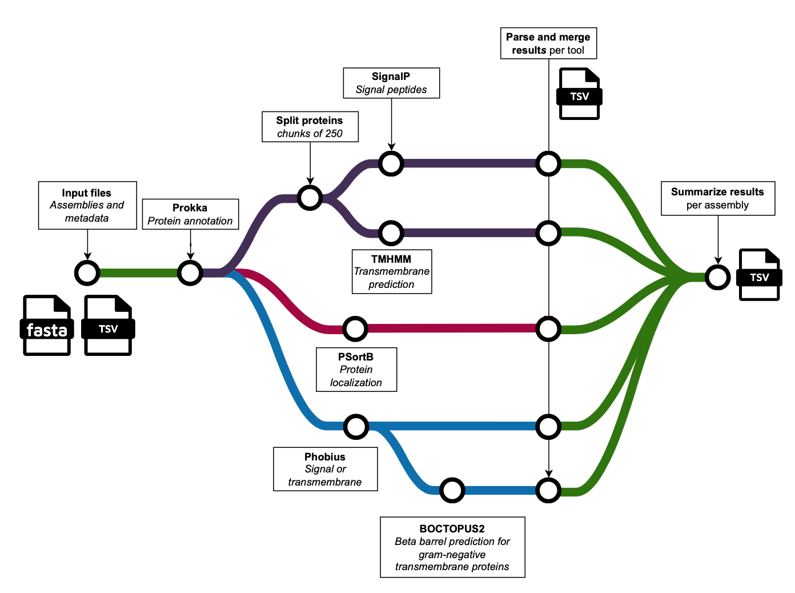

<h1>
  <picture>
    <source media="(prefers-color-scheme: dark)" srcset="docs/images/surfaceproteinsdark.png">
    
  </picture>
</h1>

[](https://www.nextflow.io/)
[](https://www.docker.com/)
[](https://sylabs.io/docs/)

## Introduction

**surfaceproteins** is a bioinformatics pipeline that annotates assemblies of bacteria and predicts subcellular localization of proteins using a number of tools.

1. Annotate assemblies with Bakta
2. Predict signal peptides using SignalP
3. Predict transmembrane regions with TMHMM
4. Predict subcellular localization using PSortB
5. Predict subcellular localization using Phobius (uses older versions of SignalP and TMHMM)
6. Predict beta barrels using BOCTOPUS2 (on a selection of proteins in gram-negatives! this one is quite slow)



## Usage

> [!NOTE]
> If you are new to Nextflow and nf-core, please refer to [this page](https://nf-co.re/docs/usage/installation) on how to set-up Nextflow. Make sure to [test your setup](https://nf-co.re/docs/usage/introduction#how-to-run-a-pipeline) with `-profile test` before running the workflow on actual data.

First, prepare a samplesheet with your input data that looks as follows:

`samplesheet.csv`:

```csv
sample,taxonomy,gram,assembly
WGS1,Escherichia coli,gram-negative,/user/path/to/assembly/WGS1_assembly.fasta
```
Each row represents an assembly.

## Prerequisites
Make sure you have **Nextflow** installed, for example in a mamba environment.

**Databases**: Additionally, download the Bakta database (container or mamba env with Bakta: `bakta_db --download`) and the HHSuite Uniprot 20 [database](https://wwwuser.gwdguser.de/~compbiol/data/hhsuite/databases/hhsuite_dbs/old-releases/) to make BOCTOPUS2 work. I have considered to build this into the workflow, but in my experience downloading these databases outside of the workflow always works better.

**Container images:** Since not all tools I used are publicly available you need to get access to some of the code yourself, and build the docker images. Unfortunately, I cannot make container images of for example SignalP and TMHMM public in Dockerhub. I'm writing separate documentation on building these container images (including Docker files), which can be found in the docs folder. When you have built the images, you need to replace the paths or links to these images in the processes.

> [!NOTE]
> This pipeline cannot be run with conda, since these tools are not available as conda packages. The workflow was built using docker container images, and can therefore be run with singularity or docker.

## Running the pipeline
Now, you can run the pipeline using:

```bash
nextflow run path/to/workflow/surfaceproteins \
   -profile <docker/singularity/.../institute> \
   --input samplesheet.csv \
   --outdir <OUTDIR> \
   --bakta_database /user/path/db/baktadb \
   --boctopus_database /user/path/db/uniprot20_2013_03
```

## Documentation
This is a pipeline in development, and I have not finished writing the documentation; apologies for the inconvience. I'm working on usage documentation, parameter documentation and output documentation of this pipeline (in the docs folder).
<!--
For more details and further functionality, please refer to the [usage documentation]() and the [parameter documentation](). For more details about the output files and reports, please refer to the [output documentation]().
-->

## Contributions and Support

Make an issue if you have suggestions for this pipeline. Thanks!

## Citations

I wrote this workflow, but I made use of existing tools. I suggest that you cite these tools when working with the results of this workflow. 